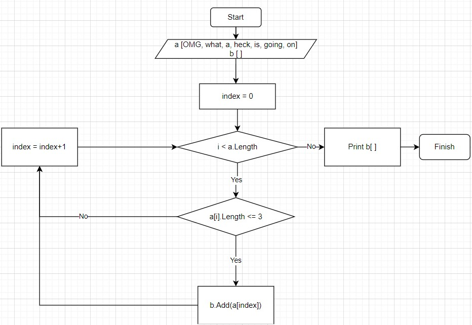

# Задача: Написать программу, которая из имеющегося массива строк формирует массив из строк, длина которых <= 3 символа.
___

**Алгоритм решения задачи**

* Объявляем статический массив из строк различной длины

* Объявляем пустой динамический массив, куда в процессе программы будем добавлять строки удовлетворяющие условию задачи

* Прописываем цикл со счетчиком, от 0 до конечной длины массива с шагом 1

* Пишем в условии критей отбора. В нашем случае длина слова должна быть <= 3

* Добавляем текущий элемент во второй массив

* В конце программы выводим второй массив

* Рисуем блоксхему (см. ниже)

Блоксхема 
